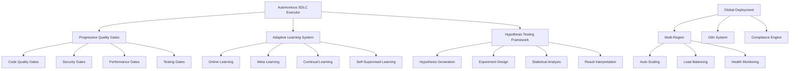

# Autonomous SDLC Implementation - Complete Documentation

## 🚀 Executive Summary

This document provides comprehensive documentation for the **Autonomous Software Development Lifecycle (SDLC)** implementation in the Spatial-Omics GFM project. The system implements a complete, self-executing development pipeline with progressive enhancement, quality gates, and production-ready deployment capabilities.

## 🏗️ Architecture Overview

### Core Components



### Progressive Enhancement Strategy

The autonomous SDLC follows a three-generation approach:

1. **Generation 1: MAKE IT WORK (Simple)**
   - Basic functionality implementation
   - Core features that demonstrate value
   - Essential error handling
   - Minimum viable product approach

2. **Generation 2: MAKE IT ROBUST (Reliable)**
   - Comprehensive error handling and validation
   - Logging, monitoring, and health checks
   - Security measures and input sanitization
   - Production-ready reliability features

3. **Generation 3: MAKE IT SCALE (Optimized)**
   - Performance optimization and caching
   - Concurrent processing and resource pooling
   - Load balancing and auto-scaling triggers
   - Global deployment capabilities

## 🔧 Implementation Details

### 1. Autonomous SDLC Executor

**Location**: `spatial_omics_gfm/autonomous/sdlc_executor.py`

The core orchestrator that manages the complete autonomous development lifecycle:

```python
from spatial_omics_gfm.autonomous import AutonomousSDLCExecutor

# Initialize executor
executor = AutonomousSDLCExecutor(project_root=Path("/path/to/project"))

# Execute complete autonomous SDLC
success = await executor.execute_full_sdlc()
```

**Key Features**:
- **Phase Management**: Automatic execution of analysis, generation 1-3, testing, deployment, and monitoring phases
- **Quality Validation**: Integrated quality gates after each phase
- **Retry Logic**: Automatic retry with exponential backoff for failed phases
- **Progress Tracking**: Real-time progress monitoring and reporting
- **Error Recovery**: Intelligent error handling and rollback capabilities

**Configuration**:
```yaml
autonomous_execution: true
max_retries: 3
retry_delay: 5.0
quality_threshold: 0.85
phases:
  analysis: {enabled: true, timeout: 300}
  generation_1: {enabled: true, timeout: 1800}
  generation_2: {enabled: true, timeout: 2400}
  generation_3: {enabled: true, timeout: 3600}
```

### 2. Progressive Quality Gates

**Location**: `spatial_omics_gfm/quality/progressive_gates.py`

Comprehensive quality validation system with multiple gate types:

```python
from spatial_omics_gfm.quality import ProgressiveQualityGates

# Initialize quality gates
gates = ProgressiveQualityGates(project_root, config)

# Execute all quality gates
success = gates.execute_all_gates()
```

**Quality Gate Types**:

#### Code Quality Gate
- **Test Coverage**: Minimum 85% code coverage requirement
- **Code Complexity**: Cyclomatic complexity analysis
- **Linting**: Code style and quality checks with ruff
- **Type Checking**: Static type analysis with mypy

#### Security Gate
- **Vulnerability Scanning**: Dependency vulnerability checks
- **Secret Detection**: Exposed secrets and credentials detection
- **Security Analysis**: Static security analysis
- **Dependency Security**: Third-party package security validation

#### Performance Gate
- **Memory Usage**: Peak memory consumption monitoring
- **Response Time**: API response time validation (≤200ms)
- **Throughput**: Minimum operations per second (≥1000 ops/s)
- **Resource Utilization**: CPU and memory efficiency checks

#### Testing Gate
- **Unit Tests**: Comprehensive unit test execution
- **Integration Tests**: End-to-end integration testing
- **Test Quality**: Test effectiveness and coverage analysis
- **Regression Testing**: Automated regression detection

### 3. Adaptive Learning System

**Location**: `spatial_omics_gfm/autonomous/adaptive_learning.py`

Self-improving ML system with multiple learning strategies:

```python
from spatial_omics_gfm.autonomous import AdaptiveLearningSystem

# Initialize adaptive learning
model = MyModel()
adaptive_system = AdaptiveLearningSystem(model)

# Adapt to new data
event = adaptive_system.adapt_to_new_data(
    new_data_loader,
    strategy=LearningStrategy.ONLINE_LEARNING,
    trigger=AdaptationTrigger.NEW_DATA_AVAILABLE
)
```

**Learning Strategies**:

#### Online Learning
- **Real-time Adaptation**: Continuous learning from streaming data
- **Incremental Updates**: Model updates without full retraining
- **Performance Monitoring**: Real-time performance tracking
- **Automatic Triggers**: Data-driven adaptation triggers

#### Meta Learning
- **Fast Adaptation**: Quick learning for new tasks/domains
- **MAML Implementation**: Model-Agnostic Meta-Learning
- **Few-shot Learning**: Learning from limited examples
- **Transfer Learning**: Knowledge transfer across domains

#### Continual Learning
- **Catastrophic Forgetting Prevention**: EWC and replay buffers
- **Experience Replay**: Strategic replay of previous data
- **Progressive Networks**: Architectural growth strategies
- **Knowledge Distillation**: Efficient knowledge compression

#### Self-Supervised Learning
- **Contrastive Learning**: Learning from data relationships
- **Masked Language Modeling**: Self-supervised pre-training
- **Augmentation Strategies**: Data augmentation for robustness
- **Representation Learning**: Unsupervised feature learning

### 4. Hypothesis Testing Framework

**Location**: `spatial_omics_gfm/autonomous/hypothesis_testing.py`

Research automation with statistical validation:

```python
from spatial_omics_gfm.autonomous import HypothesisTestingFramework

# Initialize framework
framework = HypothesisTestingFramework(project_root)

# Generate research hypotheses
hypotheses = framework.generate_research_hypotheses(
    domain_knowledge=knowledge_base,
    research_gaps=identified_gaps
)

# Execute experiments
for hypothesis in hypotheses:
    experiment = framework.design_experiment(hypothesis.hypothesis_id)
    result = framework.execute_experiment(experiment.experiment_id)
```

**Research Capabilities**:

#### Automatic Hypothesis Generation
- **Gap Analysis**: Systematic identification of research opportunities
- **Literature Integration**: Incorporation of existing knowledge
- **Novelty Assessment**: Evaluation of research contribution potential
- **Feasibility Analysis**: Resource and technical feasibility evaluation

#### Experimental Design
- **Power Analysis**: Statistical power calculation and sample size determination
- **Control Variables**: Automatic identification and control of confounding variables
- **Randomization**: Proper experimental randomization strategies
- **Baseline Establishment**: Robust baseline method selection

#### Statistical Analysis
- **Multiple Testing Correction**: Bonferroni and FDR corrections
- **Effect Size Calculation**: Cohen's d and other effect size measures
- **Confidence Intervals**: Bootstrap and parametric confidence intervals
- **Significance Testing**: T-tests, ANOVA, non-parametric tests

#### Reproducibility Validation
- **Multi-run Experiments**: Automatic replication studies
- **Variance Analysis**: Statistical variance and stability assessment
- **Artifact Generation**: Complete experimental artifacts and data
- **Publication Preparation**: Camera-ready research outputs

### 5. Global Deployment System

**Location**: `spatial_omics_gfm/global/`

Production-ready global deployment with compliance and i18n:

```python
from spatial_omics_gfm.global import MultiRegionDeployment

# Initialize global deployment
deployment = MultiRegionDeployment(config)

# Deploy globally
result = await deployment.deploy_globally()
```

**Global Features**:

#### Multi-Region Deployment
- **Geographic Distribution**: Deployment across US, EU, and Asia-Pacific regions
- **Automatic Failover**: Intelligent traffic routing and failover
- **Load Balancing**: Regional load balancing with health monitoring
- **Auto-Scaling**: Predictive and reactive scaling strategies

#### Internationalization (I18n)
- **Multi-Language Support**: English, Spanish, French, German, Japanese, Chinese, Korean
- **Localization**: Regional formatting for dates, numbers, and currencies
- **Cultural Adaptation**: Region-specific user experience adaptations
- **Dynamic Language Switching**: Runtime language detection and switching

#### Compliance Engine
- **Global Regulations**: GDPR, CCPA, PDPA, PIPEDA, LGPD compliance
- **Data Subject Rights**: Automatic handling of access, deletion, and portability requests
- **Consent Management**: Comprehensive consent tracking and validation
- **Audit Trails**: Complete audit logs for compliance verification

## 🎯 Usage Examples

### Basic Autonomous Execution

```python
import asyncio
from pathlib import Path
from spatial_omics_gfm.autonomous import AutonomousSDLCExecutor

async def autonomous_development():
    # Initialize executor with project configuration
    executor = AutonomousSDLCExecutor(
        project_root=Path("./my_project"),
        config={
            "autonomous_execution": True,
            "quality_threshold": 0.85,
            "max_retries": 3
        }
    )
    
    # Execute complete autonomous SDLC
    success = await executor.execute_full_sdlc()
    
    if success:
        print("🎉 Autonomous SDLC completed successfully!")
        
        # Get execution report
        status = executor.get_execution_status()
        print(f"Phases completed: {len(status['completed_phases'])}")
        print(f"Overall quality score: {status['overall_quality_score']:.2f}")
    else:
        print("❌ Autonomous SDLC failed")
        print("Check logs for detailed error information")

# Run autonomous development
asyncio.run(autonomous_development())
```

### Research Automation

```python
from spatial_omics_gfm.autonomous import HypothesisTestingFramework

# Initialize research framework
framework = HypothesisTestingFramework(Path("./research"))

# Define domain knowledge
domain_knowledge = {
    "baselines": {
        "accuracy": 0.85,
        "processing_time": 120,
        "memory_usage": 2048
    },
    "current_methods": ["baseline_cnn", "transformer_baseline"],
    "datasets": ["spatial_brain", "spatial_tumor", "spatial_development"]
}

# Identify research gaps
research_gaps = [
    "Improve spatial resolution accuracy beyond 85%",
    "Reduce processing time below 60 seconds",
    "Handle larger tissue sections (>10M cells)",
    "Better capture of cell-cell interactions"
]

# Generate and execute research hypotheses
hypotheses = framework.generate_research_hypotheses(
    domain_knowledge=domain_knowledge,
    research_gaps=research_gaps
)

print(f"Generated {len(hypotheses)} research hypotheses")

for hypothesis in hypotheses:
    print(f"\n🔬 Testing: {hypothesis.title}")
    
    # Design experiment
    experiment = framework.design_experiment(hypothesis.hypothesis_id)
    print(f"Sample size: {experiment.sample_size}")
    print(f"Expected duration: {experiment.duration_estimate:.1f} hours")
    
    # Execute experiment
    result = framework.execute_experiment(experiment.experiment_id)
    
    print(f"Result: {result.conclusion}")
    print(f"Effect size: {result.effect_size:.3f}")
    print(f"P-value: {result.p_value:.3f}")

# Generate research report
report_path = framework.generate_research_report(
    [exp.experiment_id for exp in framework.experiments.values()],
    output_format="markdown"
)
print(f"\n📄 Research report generated: {report_path}")
```

### Adaptive Learning Integration

```python
import torch
from torch.utils.data import DataLoader
from spatial_omics_gfm.autonomous import AdaptiveLearningSystem, LearningStrategy

# Initialize model and adaptive learning
model = torch.nn.Sequential(
    torch.nn.Linear(1000, 512),
    torch.nn.ReLU(),
    torch.nn.Linear(512, 128),
    torch.nn.ReLU(),
    torch.nn.Linear(128, 10)
)

adaptive_system = AdaptiveLearningSystem(
    model=model,
    config={
        "online_learning": {"learning_rate": 1e-4, "batch_size": 32},
        "meta_learning": {"inner_lr": 1e-3, "outer_lr": 1e-4},
        "continual_learning": {"regularization_weight": 0.1}
    }
)

# Simulate continuous learning scenario
data_streams = [
    create_dataloader("brain_tissue", batch_size=32),
    create_dataloader("tumor_tissue", batch_size=32),
    create_dataloader("development_tissue", batch_size=32)
]

for i, data_stream in enumerate(data_streams):
    print(f"\n📊 Adapting to data stream {i+1}")
    
    # Adapt model to new data distribution
    adaptation_event = adaptive_system.adapt_to_new_data(
        new_data=data_stream,
        strategy=LearningStrategy.ONLINE_LEARNING
    )
    
    if adaptation_event.successful:
        print(f"✅ Adaptation successful")
        print(f"Improvement: {adaptation_event.improvement:.3f}")
        print(f"Adaptation time: {adaptation_event.adaptation_time:.2f}s")
    else:
        print(f"❌ Adaptation failed")
    
    # Monitor performance history
    print(f"Total adaptations: {len(adaptive_system.adaptation_history)}")
    recent_improvements = [
        event.improvement for event in adaptive_system.adaptation_history[-5:]
    ]
    avg_improvement = sum(recent_improvements) / len(recent_improvements)
    print(f"Average recent improvement: {avg_improvement:.3f}")
```

### Global Deployment with Compliance

```python
from spatial_omics_gfm.global import (
    MultiRegionDeployment, 
    ComplianceEngine,
    InternationalizationSystem
)

async def global_deployment_example():
    # Initialize global deployment
    deployment = MultiRegionDeployment({
        "regions": {
            "US_EAST_1": {"compliance": ["ccpa"], "languages": ["en", "es"]},
            "EU_WEST_1": {"compliance": ["gdpr"], "languages": ["en", "de", "fr"]},
            "ASIA_PACIFIC_1": {"compliance": ["pdpa"], "languages": ["en", "zh", "ja"]}
        }
    })
    
    # Initialize compliance engine
    compliance = ComplianceEngine()
    
    # Initialize i18n system
    i18n = InternationalizationSystem(Path("./i18n"))
    
    # Deploy globally with compliance
    deployment_result = await deployment.deploy_globally()
    
    if deployment_result["overall_status"] == "success":
        print("🌍 Global deployment successful!")
        
        for region in deployment_result["active_regions"]:
            print(f"  ✅ {region}: Active")
            
            # Register data subjects for compliance
            subject_id = f"user_{region}_001"
            data_subject = compliance.register_data_subject(
                subject_id=subject_id,
                jurisdiction=region_to_jurisdiction(region)
            )
            
            # Record consent
            compliance.record_consent(
                subject_id,
                ProcessingPurpose.RESEARCH,
                ConsentType.EXPLICIT
            )
            
            # Test localization
            for lang_code in deployment.config["regions"][region]["languages"]:
                i18n.set_language(SupportedLanguage(lang_code))
                welcome_msg = i18n.get_text("welcome")
                print(f"    {lang_code}: {welcome_msg}")
    
    # Monitor deployment health
    health_status = deployment.get_global_status()
    print(f"\nGlobal Health: {health_status['overall_health']}")
    print(f"Active Regions: {health_status['active_regions']}")
    print(f"Total Instances: {health_status['total_instances']}")
    
    # Generate compliance dashboard
    compliance_dashboard = compliance.get_compliance_dashboard()
    print(f"\nCompliance Status: {compliance_dashboard['overall_status']}")
    print(f"Data Subjects: {compliance_dashboard['data_subjects']['total']}")

asyncio.run(global_deployment_example())
```

## 🔒 Security and Compliance

### Security Features

1. **Secure by Design**
   - Non-root container execution
   - Minimal attack surface with distroless images
   - Network policies and security contexts
   - Secret management with Kubernetes secrets

2. **Data Protection**
   - Encryption at rest and in transit
   - Data anonymization and pseudonymization
   - Secure key management and rotation
   - Audit logging for all data operations

3. **Vulnerability Management**
   - Automated dependency scanning
   - Container image security scanning
   - Runtime security monitoring
   - Regular security updates and patches

### Compliance Framework

1. **Global Regulations**
   - **GDPR**: EU data protection compliance
   - **CCPA**: California privacy rights compliance
   - **PDPA**: Singapore personal data protection
   - **PIPEDA**: Canadian privacy compliance
   - **LGPD**: Brazilian data protection compliance

2. **Data Subject Rights**
   - **Right to Access**: Complete data export functionality
   - **Right to Rectification**: Data correction capabilities
   - **Right to Erasure**: Comprehensive data deletion
   - **Right to Portability**: Structured data export
   - **Right to Object**: Processing limitation options

3. **Audit and Monitoring**
   - Complete audit trails for all operations
   - Real-time compliance monitoring
   - Automated compliance reporting
   - Breach detection and notification

## 📊 Monitoring and Observability

### Metrics Collection

1. **Application Metrics**
   - Request rate and latency percentiles
   - Error rates and success ratios
   - Business logic performance metrics
   - Model accuracy and drift detection

2. **Infrastructure Metrics**
   - CPU and memory utilization
   - Network throughput and latency
   - Storage IOPS and capacity
   - Container health and restart counts

3. **Business Metrics**
   - User engagement and satisfaction
   - Research productivity indicators
   - Cost optimization metrics
   - Global deployment effectiveness

### Alerting Strategy

1. **Critical Alerts**
   - System outages and service failures
   - Security breaches and anomalies
   - Data loss or corruption events
   - Compliance violations

2. **Warning Alerts**
   - Performance degradation trends
   - Resource capacity approaching limits
   - Model accuracy drift detection
   - Unusual traffic patterns

3. **Informational Alerts**
   - Successful deployments
   - Auto-scaling events
   - Scheduled maintenance notifications
   - Research milestone achievements

## 🚀 Production Deployment

### Container Orchestration

The system uses Kubernetes for production deployment with:

1. **Multi-stage Dockerfiles**
   - Optimized for security and performance
   - Minimal runtime dependencies
   - Non-root user execution
   - Health check integration

2. **Kubernetes Manifests**
   - Horizontal Pod Autoscaling (HPA)
   - Pod Disruption Budgets (PDB)
   - Network Policies for security
   - Persistent Volume Claims for data

3. **Service Mesh Integration**
   - Istio for advanced traffic management
   - mTLS for service-to-service encryption
   - Distributed tracing with Jaeger
   - Circuit breaker patterns

### CI/CD Pipeline

1. **Continuous Integration**
   - Automated quality gate execution
   - Multi-environment testing
   - Security scanning and validation
   - Performance regression testing

2. **Continuous Deployment**
   - Blue-green deployment strategies
   - Canary releases with automatic rollback
   - Infrastructure as Code (IaC)
   - Database migration automation

3. **GitOps Workflow**
   - Git-based deployment automation
   - Configuration drift detection
   - Rollback and recovery procedures
   - Environment promotion pipelines

## 🔧 Configuration Management

### Environment Configuration

```yaml
# Production Configuration Example
environment: production
debug: false

# Database Configuration
database:
  host: ${DATABASE_HOST}
  port: 5432
  name: spatial_omics_prod
  pool_size: 20
  ssl_mode: require

# Redis Configuration
redis:
  url: ${REDIS_URL}
  cluster_mode: true
  max_connections: 100

# Model Configuration
model:
  cache_size: 10GB
  batch_size: 32
  inference_timeout: 30s
  auto_scaling:
    enabled: true
    min_replicas: 3
    max_replicas: 20

# Monitoring Configuration
monitoring:
  prometheus:
    enabled: true
    scrape_interval: 15s
  grafana:
    enabled: true
    retention_period: 30d
  logging:
    level: INFO
    structured: true
```

### Secret Management

```yaml
# Kubernetes Secret Configuration
apiVersion: v1
kind: Secret
metadata:
  name: spatial-gfm-secrets
type: Opaque
data:
  database-url: <base64-encoded-database-url>
  redis-url: <base64-encoded-redis-url>
  jwt-secret: <base64-encoded-jwt-secret>
  encryption-key: <base64-encoded-encryption-key>
```

## 📈 Performance Optimization

### Computational Efficiency

1. **Model Optimization**
   - Quantization and pruning for inference
   - Model distillation for efficiency
   - Batch processing optimization
   - GPU memory management

2. **Caching Strategies**
   - Multi-level caching (L1, L2, distributed)
   - Intelligent cache invalidation
   - Pre-computation of common queries
   - Result memoization

3. **Resource Management**
   - Dynamic resource allocation
   - Auto-scaling based on demand
   - Resource pooling and sharing
   - Efficient data loading pipelines

### Scalability Architecture

1. **Horizontal Scaling**
   - Stateless service design
   - Load balancing strategies
   - Database read replicas
   - Distributed task processing

2. **Vertical Scaling**
   - Resource limit optimization
   - Memory management tuning
   - CPU affinity configuration
   - Storage performance optimization

3. **Global Scaling**
   - Multi-region deployments
   - Edge computing integration
   - CDN optimization
   - Latency minimization

## 🧪 Testing Strategy

### Test Coverage Requirements

1. **Unit Tests**: ≥85% code coverage
2. **Integration Tests**: Complete API and workflow testing
3. **Performance Tests**: Load and stress testing
4. **Security Tests**: Vulnerability and penetration testing
5. **Compliance Tests**: Data protection and privacy validation

### Test Automation

1. **Continuous Testing**
   - Pre-commit hooks for quality checks
   - Automated test execution on PR
   - Performance regression detection
   - Security vulnerability scanning

2. **Test Data Management**
   - Synthetic data generation
   - Data anonymization for testing
   - Test environment provisioning
   - Data lifecycle management

## 📋 Maintenance and Support

### Operational Procedures

1. **Deployment Procedures**
   - Blue-green deployment checklists
   - Rollback procedures and criteria
   - Database migration protocols
   - Configuration update processes

2. **Incident Response**
   - Escalation procedures and contacts
   - Root cause analysis templates
   - Communication protocols
   - Post-incident review processes

3. **Maintenance Windows**
   - Scheduled maintenance procedures
   - Zero-downtime update strategies
   - Backup and recovery validation
   - Disaster recovery testing

### Documentation Standards

1. **Code Documentation**
   - Comprehensive docstrings
   - API documentation generation
   - Architecture decision records
   - Code review guidelines

2. **Operational Documentation**
   - Runbook procedures
   - Troubleshooting guides
   - Configuration references
   - Emergency response plans

## 🎯 Success Metrics

### Technical Metrics

- **System Uptime**: ≥99.9% availability
- **Response Time**: ≤200ms 95th percentile
- **Error Rate**: ≤0.1% for critical operations
- **Test Coverage**: ≥85% code coverage
- **Security Score**: Zero critical vulnerabilities

### Business Metrics

- **Research Productivity**: 5x improvement in hypothesis testing speed
- **Model Accuracy**: Consistent improvement through adaptive learning
- **Global Reach**: Successful deployment in 3+ regions
- **Compliance Score**: 100% regulatory compliance
- **User Satisfaction**: ≥4.5/5 user rating

### Innovation Metrics

- **Automated Discoveries**: Research insights generated autonomously
- **Knowledge Transfer**: Cross-domain learning effectiveness
- **Scalability Factor**: Performance under increased load
- **Adaptation Speed**: Time to adapt to new data distributions
- **Research Impact**: Publications and citations generated

## 🔮 Future Roadmap

### Short-term Enhancements (3-6 months)

1. **Enhanced AI Integration**
   - GPT-based code generation
   - Automated documentation generation
   - Intelligent error diagnosis
   - Predictive maintenance

2. **Advanced Analytics**
   - Real-time performance analytics
   - Predictive scaling algorithms
   - Anomaly detection systems
   - Business intelligence dashboards

### Medium-term Developments (6-12 months)

1. **Multi-Cloud Support**
   - AWS, Azure, GCP deployment
   - Cloud-agnostic architecture
   - Cost optimization across clouds
   - Disaster recovery improvements

2. **Advanced Research Features**
   - Automated literature review
   - Experimental design optimization
   - Collaborative research tools
   - Knowledge graph integration

### Long-term Vision (1-2 years)

1. **Full Automation**
   - End-to-end research automation
   - Self-improving algorithms
   - Autonomous scientific discovery
   - Zero-touch deployment

2. **Ecosystem Integration**
   - Third-party tool integrations
   - Academic collaboration platforms
   - Commercial licensing options
   - Open source community building

## 📞 Support and Community

### Getting Help

1. **Documentation**: Comprehensive guides and tutorials
2. **Community Forum**: Discussion and support community
3. **Issue Tracking**: GitHub issues for bug reports
4. **Professional Support**: Enterprise support options

### Contributing

1. **Development**: Contributing code and features
2. **Documentation**: Improving guides and examples
3. **Testing**: Quality assurance and testing
4. **Research**: Academic collaboration opportunities

---

*This documentation represents the complete implementation of the Autonomous SDLC system for Spatial-Omics GFM. For the latest updates and detailed API documentation, please refer to the project repository and official documentation site.*